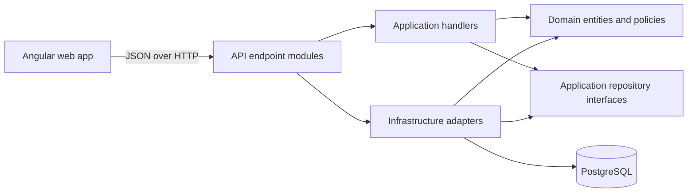

# Architecture

This repository uses a layered modular monolith. The layers make business rules testable and keep framework details at the system boundary while preserving the simplicity of one deployable API and one web application.



Dependencies point toward the domain. The API and Infrastructure projects may depend on Application and Domain; Application may depend on Domain; Domain has no project dependencies. `ApiBootstrap` is the composition root that connects implementations to interfaces.

## Backend responsibilities

| Project | Responsibility | Typical contents |
| --- | --- | --- |
| `AgenticJobSearch.Domain` | Persistent business concepts with no web or database dependencies | `Job`, `Application`, `CandidateProfile`, `WorkflowChange` |
| `AgenticJobSearch.Application` | Use cases, deterministic policies, DTOs, and ports required from infrastructure | handlers, `JobWorkflowPolicy`, repository interfaces |
| `AgenticJobSearch.Infrastructure` | Adapters for PostgreSQL and external sources | EF repositories, entity configurations, import adapters |
| `AgenticJobSearch.Api` | HTTP transport and process composition | endpoint modules, authentication setup, middleware, dependency registration |
| `AgenticJobSearch.Worker` | Background process host | scheduled or asynchronous work when a use case requires it |

Endpoint modules translate HTTP input and output. They should not contain persistence rules. Application handlers coordinate one use case. Policies contain deterministic rules that can be unit tested without a database. Repositories implement owner-scoped persistence behind Application interfaces. EF entity configurations keep schema mapping separate from the `DbContext`.

For example, an application status update follows this path:

```text
JobEndpoints
  -> UpdateJobWorkflowHandler
  -> JobWorkflowPolicy
  -> IJobRepository
  -> JobRepository / JobSearchDbContext
  -> PostgreSQL
```

The database is authoritative for workflow state. The frontend may present the allowed choices for responsiveness, but the backend policy validates every transition.

## Frontend responsibilities

The Angular application separates shared transport state from feature behavior:

- `auth.service.ts` owns the browser session and current account.
- `job-store.service.ts` owns the loaded job collection and API mutations.
- `features/applications/application-workflow.model.ts` owns application workflow form mapping and presentation options.
- `features/profile` owns the candidate-profile contract, completeness calculation, and API state.
- page components own view state such as selection, filtering, and sorting.
- `job.model.ts` contains the shared API-facing job model and broadly reused job helpers.

As a feature grows, place its types and deterministic behavior under `features/<feature>` before introducing additional services. A facade is warranted when a component begins coordinating several stores or long-lived asynchronous workflows; small local view state should remain in the component.

## Design conventions

1. Prefer composition, dependency injection, and focused classes over inheritance hierarchies.
2. Keep one reason to change per module: HTTP, use-case orchestration, business policy, or persistence.
3. Put interfaces at the layer that consumes the capability. Infrastructure implements Application ports.
4. Keep domain and policy logic deterministic and cover state transitions with unit tests.
5. Scope all account-owned reads and writes in repository implementations.
6. Add infrastructure only when a concrete requirement needs it; this remains a modular monolith.
7. Preserve verified candidate evidence and never infer resume claims from implementation details.

## Adding a feature

Start with the business behavior and its tests. Add or extend a domain entity only when state belongs to the domain. Implement the use case as an Application handler and add a repository port if persistence is needed. Implement that port in Infrastructure, map the HTTP contract in a focused API endpoint module, then add the frontend feature model and UI. Register new handlers and adapters in the existing dependency injection modules.

Database schema changes require a reviewed EF Core migration. Moving configuration between classes without changing the resulting EF model does not require a migration.
