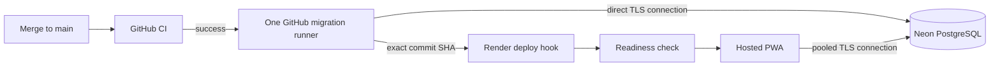

# Free deployment runbook

This runbook publishes the private beta on a Render free web service backed by Neon PostgreSQL. The repository keeps credentials out of source control, applies migrations once in GitHub Actions, and deploys the exact commit that passed CI.

The checked-in configuration targets Render's Ohio region. Choose Neon's AWS Ohio region (`aws-us-east-2`) when creating the database to reduce latency. Changing a Render service's region later requires recreating it.

## Deployment flow



Render's free web service does not support a pre-deploy command. For that reason, `render.yaml` disables Render auto-deploys. The `Deploy hosted beta` GitHub workflow applies migrations first and calls the secret deploy hook with the CI-verified commit SHA. Keep `Hosting__ApplyMigrationsOnStartup=false`; this prevents the old and new web processes from competing to change the schema during a zero-downtime deployment.

## 1. Create the Neon database

1. Create a free Neon project in AWS Ohio and keep its default `main` branch.
2. Open **Connect** in the Neon console.
3. Copy both connection endpoints:
   - **Pooled** endpoint for the Render application. Its host contains `-pooler`.
   - **Direct** endpoint for GitHub's migration runner. Its host does not contain `-pooler`.
4. Convert each URI to the Npgsql key/value form below. Keep the generated values private.

```text
Host=<endpoint-host>;Database=<database>;Username=<role>;Password=<password>;SSL Mode=VerifyFull;Channel Binding=Require
```

Use the pooled host for `ConnectionStrings__JobSearch` in Render and the direct host for the `NEON_MIGRATION_CONNECTION_STRING` GitHub secret. `VerifyFull` encrypts the connection and validates both the certificate chain and host name. The direct endpoint is reserved for migrations; normal application traffic uses Neon's transaction pooler.

## 2. Generate private launch secrets

Generate a registration token and certificate password on a trusted computer:

```sh
openssl rand -base64 48
openssl rand -base64 48
```

Use the first output as `Accounts__RegistrationBootstrapToken` and the second as `Hosting__DataProtectionCertificatePassword`. Then create the data-protection certificate as described in [production configuration](production-configuration.md#generate-the-data-protection-certificate). Its single-line base64 output becomes `Hosting__DataProtectionCertificateBase64`.

Do not save these values in this repository, workflow logs, issue text, or pull-request text. Back up the PFX and its password separately from Neon; losing them invalidates existing login sessions after a redeployment.

## 3. Create the Render service

1. In Render, choose **New > Blueprint** and connect `RRKaze/agentic-job-search`.
2. Select the repository's `render.yaml` from `main`.
3. Keep the free plan and enter the secret values Render requests:

| Render environment variable | Value |
| --- | --- |
| `AllowedHosts` | The generated host only, for example `agentic-job-search.onrender.com` |
| `ConnectionStrings__JobSearch` | Neon **pooled** Npgsql connection string |
| `Accounts__RegistrationBootstrapToken` | First generated random value, at least 32 characters |
| `Hosting__DataProtectionCertificateBase64` | Single-line base64 PFX content |
| `Hosting__DataProtectionCertificatePassword` | Second generated random value, at least 16 characters |

The Blueprint supplies the remaining non-secret values. It leaves registration open only for the owner bootstrap, disables administrative imports, binds the public port, uses database readiness for health checks, and keeps automatic deployment off.

If the service name is changed, enter its actual `onrender.com` hostname in `AllowedHosts`. Do not include `https://` or a path.

## 4. Connect GitHub to the services

In the GitHub repository, open **Settings > Secrets and variables > Actions** and create two repository secrets:

| GitHub secret | Value |
| --- | --- |
| `NEON_MIGRATION_CONNECTION_STRING` | Neon **direct** Npgsql connection string |
| `RENDER_DEPLOY_HOOK_URL` | Secret deploy hook from the Render service's Settings page |

The deployment workflow safely skips when these secrets do not exist, which lets this configuration merge before the accounts are connected. After adding them, open **Actions > Deploy hosted beta**, choose **Run workflow**, and select `main`. The workflow migrates the database and asks Render to deploy that exact commit.

For later merges, a successful `CI` run on `main` starts this sequence automatically. A failed migration prevents the Render call, so the current application remains live.

## 5. Bootstrap and lock the owner account

1. Open the Render HTTPS address and choose registration.
2. Create the owner's account using the bootstrap token.
3. In Render, set `Accounts__RegistrationEnabled` to `false` and remove the value of `Accounts__RegistrationBootstrapToken`.
4. Save the environment changes and allow Render to redeploy the same application version.
5. Confirm the owner can sign in and a new registration attempt returns `404`.

Keep registration closed during the private beta. Generate a new bootstrap token instead of reopening with the original token if account recovery is ever required.

## 6. Verify the hosted application

Run the public checks locally after the service reports Live:

```sh
./scripts/hosted-smoke-test.sh https://<service>.onrender.com --expect-registration-closed
```

The script tolerates a free-tier cold start and checks HTTPS, process and database health, the Angular shell, standalone manifest, unauthenticated access control, unknown API handling, correlation IDs, and closed registration. It sends only a deliberately invalid registration request and never creates an account.

The same checks are available from **Actions > Hosted smoke test**. Enter the Render base URL and leave **expect registration closed** selected.

Complete these signed-in checks manually on desktop and phone:

1. Sign in, sign out, and sign in again.
2. Update the personal profile and confirm it remains after refresh.
3. Save and score a real opportunity.
4. Move it into Applications, change its status, and add a next action.
5. Confirm another signed-out browser cannot read `/api/jobs` or `/api/candidate-profile`.
6. Redeploy the same commit and confirm the session and saved data survive.
7. Install the PWA from Android Chrome and iOS Safari, open it from the Home Screen, and repeat the core workflow.

Record device-specific problems as focused issues. Free Render and Neon services can both wake from idle, so the first request may be slower than later requests.

## Operational checks

- Inspect Render logs using correlation IDs; never paste private request content into an issue.
- Review Neon storage, compute, and transfer usage during the daily-use pilot.
- Treat a failed migration as a stopped release. Fix or roll it forward; do not enable startup migrations.
- Complete the backup and restore slice before relying on the hosted database as the only copy of important data.

Provider references: [Render Blueprint specification](https://render.com/docs/blueprint-spec), [Render deploy hooks](https://render.com/docs/deploy-hooks), [Render health checks](https://render.com/docs/health-checks), [Render free services](https://render.com/docs/free), [Neon compute management](https://neon.com/docs/manage/endpoints/), and [Npgsql TLS modes](https://www.npgsql.org/doc/security.html).
