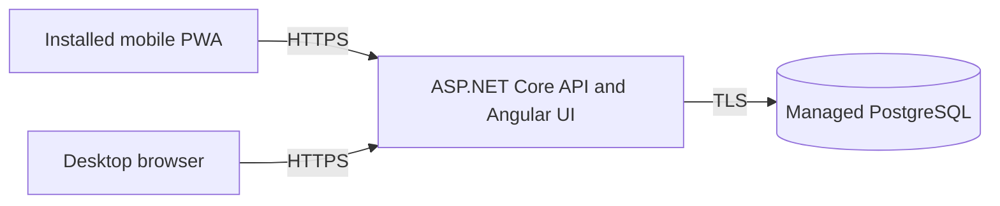

# Free hosted beta and installable web app

## Goal

Publish a private daily-use version of Agentic Job Search that can be opened from desktop and installed from a mobile browser as a standalone Progressive Web App (PWA). The first launch must stay within free hosting allowances and preserve the existing human-controlled, evidence-backed workflow.

This is a personal beta rather than a public service. Cold starts, limited recovery history, and the absence of a paid uptime guarantee are acceptable during the pilot. Data loss, open registration, exposed administration tools, and silently cached private API responses are not acceptable.

## Target architecture

The Angular production build and ASP.NET Core API are served from one container and one HTTPS origin. This keeps cookie authentication and request protection simple. PostgreSQL remains an external managed service so application deployments cannot erase user data.

## Initial free services

Provider details in this section were last reviewed on 2026-09-27 and must be checked again before provisioning.

- **Application hosting:** Render free web service using the repository's production Dockerfile.
- **Database:** Neon free PostgreSQL. Do not use Render's free PostgreSQL offering because free databases expire after 30 days.
- **Address:** the generated `onrender.com` HTTPS address. A purchased custom domain is optional and outside the zero-cost launch.
- **Mobile installation:** an Angular PWA manifest and service worker with `display: standalone`.

Free-service limits can change. Confirm them before provisioning. The expected beta tradeoffs are:

- the application host can sleep when idle, causing a slow first request;
- the database can suspend when idle and resume on demand;
- database storage, compute, transfer, logs, and restore history are limited;
- neither service provides a production uptime commitment on its free plan.

See the current [Render free-service behavior](https://render.com/docs/faq), [Render deployment documentation](https://render.com/docs/docker), [Render datastore warning](https://render.com/docs/your-first-deploy), and [Neon free-plan information](https://neon.com/blog/neon-backend-is-ga).

## Security and data rules

1. Keep the first hosted workspace private and single-user.
2. Require a one-time bootstrap or invitation secret for initial registration, then disable registration.
3. Serve the browser and API from the same HTTPS origin.
4. Keep secure, HttpOnly, SameSite cookies and the existing mutation-header protection.
5. Persist ASP.NET Core data-protection keys so a deployment does not invalidate every session. Protect the persisted key ring with a deployment secret.
6. Require TLS for the PostgreSQL connection and keep the connection string in host-managed secrets.
7. Keep import endpoints disabled during normal operation.
8. Never deploy Adminer or expose the PostgreSQL port publicly.
9. Do not write passwords, cookies, connection strings, resume content, job-description bodies, or candidate evidence to logs.
10. Do not cache authenticated API responses in the PWA service worker.

## Execution plan

### Slice 1: production runtime

1. [x] Add a multi-stage production Dockerfile that builds Angular with the pinned Node version and publishes the .NET API.
2. [x] Copy the Angular browser output into the API's static-file directory.
3. [x] Configure ASP.NET Core to serve static assets and fall back to `index.html` for client routes.
4. [x] Add typed configuration and fail startup when required production settings are missing.
5. [x] Respect forwarded HTTPS headers from the hosting proxy.
6. [x] Add liveness and readiness endpoints suitable for a hosting health check.
7. [x] Add structured request logs and a correlation identifier returned in response headers.
8. [x] Add a dedicated migration command so schema upgrades complete before new application code serves traffic.
9. [x] Add the private registration/bootstrap control.
10. [x] Persist and protect the data-protection key ring.

### Slice 2: installable mobile PWA

1. [x] Add Angular PWA support, a web manifest, service-worker configuration, and production icons.
2. [x] Use `display: standalone`, application colors, and a stable application name.
3. [x] Cache only versioned application-shell assets.
4. [x] Show a clear offline state when API requests cannot run.
5. [x] Detect a newly deployed application version and prompt the user to refresh.
6. [x] Verify navigation, forms, dialogs, tables, and status controls at phone widths.
7. [x] Provide touch targets and focus states suitable for mobile use.
8. [ ] Test installation and core workflows on current iOS Safari and Android Chrome.

Angular's PWA setup and HTTPS requirements are documented in the [Angular service-worker guide](https://angular.dev/ecosystem/service-workers/getting-started). Apple's standalone Home Screen behavior is described in [Web apps on iOS and iPadOS](https://developer.apple.com/videos/play/wwdc2023/10120/).

### Slice 3: reproducible free deployment

1. Add a `render.yaml` blueprint for the web service, health check, Docker build, and CI-gated deployment.
2. Document creation of a Neon project and use of its pooled TLS connection string.
3. Document every required environment variable without committing a value.
4. Deploy the application from `main` only after repository checks pass.
5. Run migrations against the hosted database.
6. Create the owner's account through the protected bootstrap flow and close registration.
7. Verify authentication, ownership boundaries, scoring, application updates, and logout through the hosted URL.
8. Install the application on a phone from the hosted HTTPS address.

### Slice 4: backup and recovery

1. Add a script that creates a timestamped logical backup with `pg_dump` without embedding credentials.
2. Store backups outside the application host and outside the Neon project.
3. Take a backup before every production migration and at least weekly during the pilot.
4. Restore a backup into a disposable database and run a documented integrity check.
5. Record the backup time, migration version, restore result, and operator without storing candidate data in the repository.

The free database's short restore history is a convenience, not the only recovery mechanism. Logical backups remain required.

### Slice 5: daily-use pilot

Use the hosted application as the primary tracker for two weeks. During the pilot:

- add and evaluate real job opportunities;
- update application state and next actions from both desktop and mobile;
- record incorrect scores and missing workflow information;
- measure cold-start delay and note failed or confusing interactions;
- verify that deployment does not lose data or invalidate sessions unexpectedly;
- confirm a recent backup can still be restored.

Convert repeated friction into focused issues. Do not begin semantic scoring or browser-driven application submission until the pilot shows that the persisted workflow is dependable.

## Pull-request sequence

1. **Production hosting baseline:** container, same-origin static hosting, production configuration, proxy handling, health checks, logging, registration control, data-protection keys, and migration command.
2. **Mobile PWA:** manifest, icons, service worker, update behavior, offline state, and responsive usability fixes.
3. **Free deployment:** Render blueprint, Neon setup documentation, environment reference, deployment runbook, and hosted smoke checks.
4. **Backup and pilot operations:** backup and restore scripts, recovery runbook, and pilot checklist.

Keep these changes independently reviewable. Each pull request must leave local development working and must include tests appropriate to its behavior.

## Launch acceptance criteria

- CI passes before a deployment can start.
- The hosted application is reachable over HTTPS.
- Only the owner can create or access the workspace.
- Registration is closed after bootstrap.
- PostgreSQL survives application rebuilds and redeployments.
- Authentication survives an ordinary application redeployment.
- Migrations can run without a second application instance racing them.
- The PWA installs and opens in standalone mode on a phone.
- A user can save, score, and track a job from mobile.
- Private API data is absent from service-worker caches.
- Logs identify a failed request by correlation ID without exposing private content.
- A hosted database backup has been restored successfully.

## Upgrade triggers

Remain on the free stack during the personal pilot. Reconsider paid hosting when any of the following becomes true:

- cold starts regularly prevent daily use;
- free database storage, compute, or transfer approaches 80 percent of its allowance;
- recovery requirements exceed the free restore window and logical-backup process;
- more than one real user needs an account;
- email verification, password recovery, or public registration is required;
- uptime becomes important enough to require an availability commitment.
